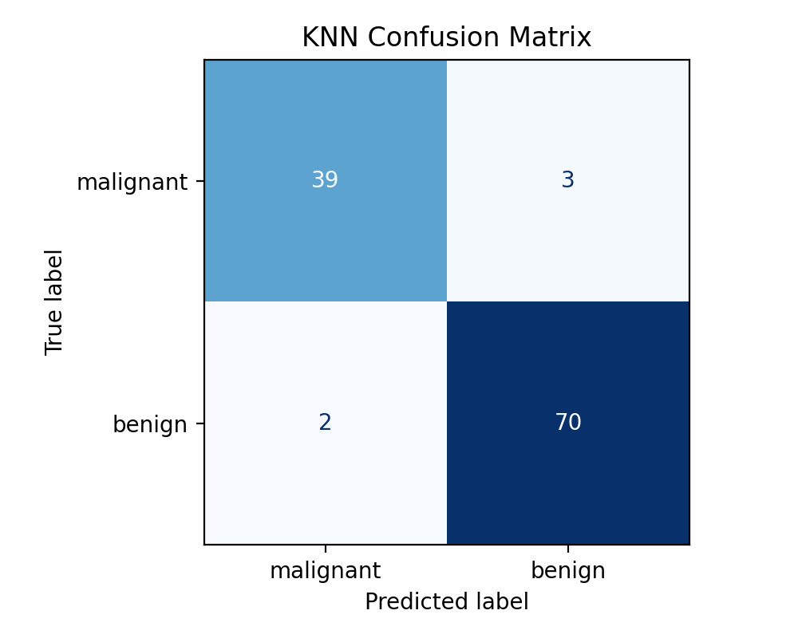

# Section 1: Task Description

This project implements and compares three machine learning classifiers on the Breast Cancer dataset from `sklearn`: K-Nearest Neighbors (KNN), Decision Tree, and Random Forest.  
The task is binary classification (`malignant` vs `benign`) with an 80/20 train-test split.  
The experiment includes:

- Baseline model comparison using fixed default settings
- Evaluation by Accuracy, Precision, Recall, and F1-score
- Confusion matrix analysis for each classifier
- Hyperparameter ablation study to observe performance changes

# Section 2: Model Description

KNN is a distance-based non-parametric method that predicts labels from nearby training examples. Because KNN uses distance directly, feature scaling is required for stable behavior.

Decision Tree is a rule-based model that recursively splits features to reduce impurity. It is interpretable but can overfit when depth is unconstrained.

Random Forest is an ensemble of multiple decision trees trained on bootstrapped samples and random feature subsets. It usually improves stability and reduces overfitting compared with a single tree.

# Section 3: Experiment Settings

## 3.1 Dataset Description

The Breast Cancer dataset loaded by `load_breast_cancer` has:

- 569 total samples
- 30 numeric features
- 2 classes: `malignant` and `benign`

Data split:

- Training set: 455 samples (80%)
- Test set: 114 samples (20%)
- `random_state=42` and stratified split

## 3.2 Detailed Experimental Setups

Baseline settings:

- KNN: `n_neighbors=5` with `StandardScaler` + classifier pipeline
- Decision Tree: default settings (`DecisionTreeClassifier(random_state=42)`)
- Random Forest: `n_estimators=100` (`RandomForestClassifier(random_state=42)`)

Ablation settings:

- KNN: `n_neighbors` in `[3, 5, 7, 9, 11]`
- Decision Tree: `max_depth` in `[None, 3, 5, 7, 10]`
- Random Forest:
  - `max_depth` in `[None, 5, 10]`
  - `min_samples_split` in `[2, 4]`
  - `n_estimators=100` fixed

## 3.3 Evaluation Metrics

The following metrics were computed on the test set for each configuration:

- Accuracy: overall classification correctness
- Precision: proportion of positive predictions that are correct
- Recall: proportion of true positives correctly identified
- F1-score: harmonic mean of precision and recall

In this report, Precision/Recall/F1 are computed with `benign (label=1)` as the positive class (sklearn default).

## 3.4 Source Code

GitHub repository:

- https://github.com/koi-ama/ICS435-a1

Main executable script:

- `src/main.py`

## 3.5 Model Performance

Baseline model comparison:

| Model | Setting | Accuracy | Precision | Recall | F1 |
|---|---|---:|---:|---:|---:|
| Decision Tree | default | 0.9123 | 0.9559 | 0.9028 | 0.9286 |
| KNN | n_neighbors=5 | 0.9561 | 0.9589 | 0.9722 | 0.9655 |
| Random Forest | n_estimators=100 | 0.9561 | 0.9589 | 0.9722 | 0.9655 |

Confusion matrices (baseline):

{ width=60% }

{ width=60% }

{ width=60% }

## 3.6 Ablation Studies

Best setting found for each model family:

| Model | Best Setting | Accuracy | Precision | Recall | F1 |
|---|---|---:|---:|---:|---:|
| Decision Tree | max_depth=3 | 0.9386 | 0.9452 | 0.9583 | 0.9517 |
| KNN | n_neighbors=3 | 0.9825 | 0.9730 | 1.0000 | 0.9863 |
| Random Forest | n_estimators=100, max_depth=None, min_samples_split=2 | 0.9561 | 0.9589 | 0.9722 | 0.9655 |

Selected ablation trend samples (F1):

| Model | Setting A | F1 A | Setting B | F1 B | Setting C | F1 C |
|---|---|---:|---|---:|---|---:|
| KNN | n_neighbors=3 | 0.9863 | n_neighbors=5 | 0.9655 | n_neighbors=11 | 0.9796 |
| Decision Tree | max_depth=3 | 0.9517 | max_depth=5 | 0.9362 | max_depth=None | 0.9286 |
| Random Forest | depth=None, split=2 | 0.9655 | depth=10, split=2 | 0.9655 | depth=10, split=4 | 0.9583 |

KNN improved when reducing neighbors from 5 to 3 (best F1), Decision Tree improved with `max_depth=3`, and Random Forest remained stable with a small drop at `min_samples_split=4`.

# Section 4: Conclusion

All three classifiers performed strongly on this dataset, but KNN achieved the best overall test performance after tuning (`n_neighbors=3`, F1 = 0.9863).  
Random Forest provided robust and consistent results close to tuned KNN, while Decision Tree benefited clearly from controlled depth.  
For this task, tuned KNN is the best-performing option, while Random Forest remains a strong and reliable alternative due to stable behavior across hyperparameter settings.
